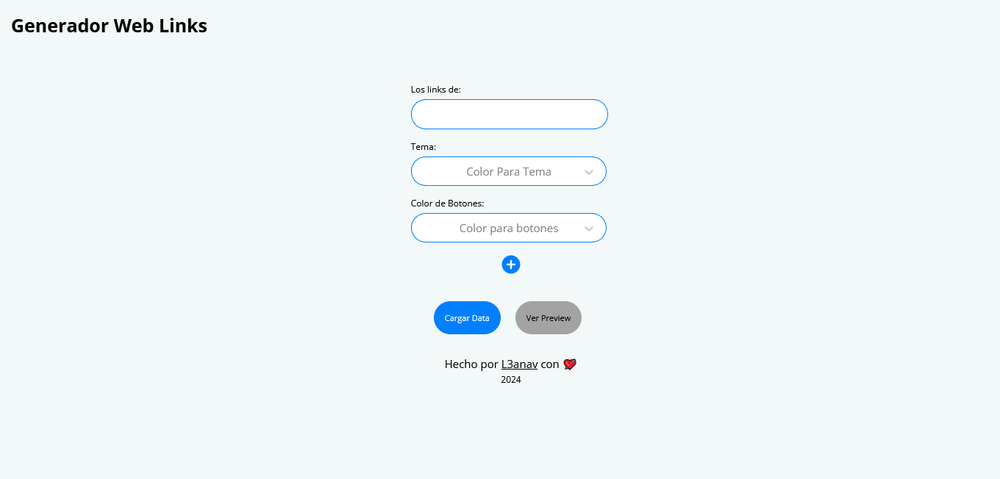

= Generador Links

[comment]
Author <leanav.dev@gmail.com>, {docdate}.

App para automatizar la creación de una página simple de links, estilo linktr.ee.

== Breve resumen del proyecto.

El proyecto empezó siendo un CLI para la terminal en el cual se elegia atravez de ella opciones, luego de terminar de elegir se buildeaba localmente la app de links.

Ahora luego de repensar la idea, se puede usar una web app que utiliza el backend de la rama main del respositorio mis-likns-generador, desplegado en render.com atravez de un dockerfile. 

Para consultar la API REST podes dirigirte al https://github.com/l3anav/mis-links-generador[Repositorio].

El CLI se puede descargar desde la https://github.com/L3anAv/mis-links-generador/tree/con-terminal[Rama con Terminal].

== Uso
&#13;

[square]
- Paso 1:

Complete el formulario con los datos solicitados y cargue los datos, vea la vista previa.

[square]
- Paso 2:

Al probar los enlaces en la vista previa, tiene dos opciones, volver hacia atras y modificar los campos, colores. etc o dar en descargar obteniendo un .zip con los archivos dentro de su web estilo linktr.ee.

[square]
- Paso 3:

Puede subir a su hosting de confianza los archivos descargados o a un respositorio de github para desplegar en github pages, si así lo desea.

_* Los archivos descargados no se guardan en el servidor._

== Stack
&#13;

image::https://skillicons.dev/icons?i=react,vite,styledcomponents,pnpm,powershell[]

> Desplegado en vercel.com.

== Librerias
&#13;

[square]
-  https://www.npmjs.com/package/file-saver[File Saver]: Permite guardar archivos en el navegador del cliente. 

- https://www.npmjs.com/package/react-hook-form[React Hook Form]: Proporciona un conjunto de hooks personalizados para manejar formularios en React de forma eficiente. 

- https://www.npmjs.com/package/react-select[React Select]: Un componente de selección altamente personalizable para React.

- https://www.npmjs.com/package/styled-components[Styled Components]: Permite escribir estilos CSS directamente en tus componentes de JavaScript. 

- https://www.npmjs.com/package/wouter[Wouter]: Una biblioteca de enrutamiento sencilla y flexible para React. 

- https://www.npmjs.com/package/zustand[Zustand]: Un mini gestor de estado para proyectos React.

